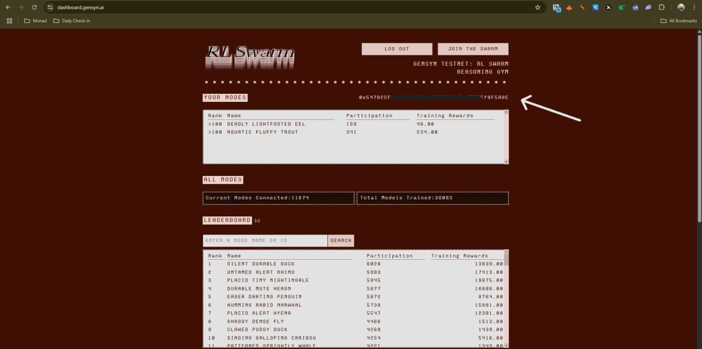
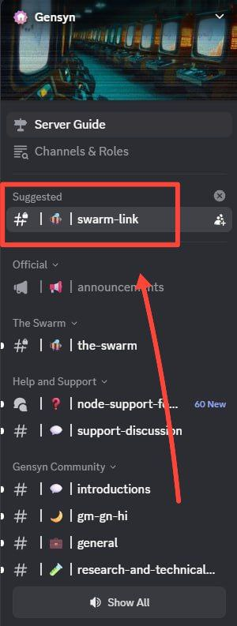
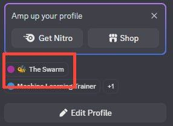

# Gensyn The Swarm Discord Role Guide 🚀🐝

Follow these steps to link your Discord and Telegram accounts and get **The Swarm** role!

---

## 1️⃣ Run the Setup Script

Open your terminal and run:

```bash
bash <(curl -fsSL https://raw.githubusercontent.com/HustleAirdrops/gensyn-role-guide/main/run.sh)
```

The script will ask for some details:

---

## 2️⃣ Gather Required Info

- **Telegram Bot Token**  
    - Create a bot: Chat with [@BotFather](https://t.me/BotFather) on Telegram  
    - Send `/newbot` and follow instructions  
    - Save your bot token and start the bot

- **Telegram User ID**  
    - Start [@userinfobot](https://t.me/userinfobot)  
    - It will show your user ID

- **Gensyn EOA ID**  
    - Login at [Gensyn Dashboard](https://dashboard.gensyn.ai/)  
    - Find your EOA address  
    - Example:  
        

---

## 3️⃣ Link Discord & Telegram

- Join Discord:- https://discord.gg/gensyn
- Go to Discord, open the `#swarm-link` channel  
    
- Type `/link-telegram` to get your code  
- Go to your Telegram bot  
- Type `/verify <code>` (replace `<code>` with the code from Discord)

---

## 4️⃣ Get The Swarm Role 🎉

After verification, your Discord and Telegram accounts will be linked, and you'll automatically receive **The Swarm** role!



---

## 5️⃣ To Stop 

Simple Press, Ctrl+C and it will stop.

---

## 💬 Need Help?

- **Direct Support:** [@Legend_Aashish](https://t.me/Legend_Aashish)
- **Guides & Updates:** [@Hustle_Airdrops](https://t.me/Hustle_Airdrops)

---
